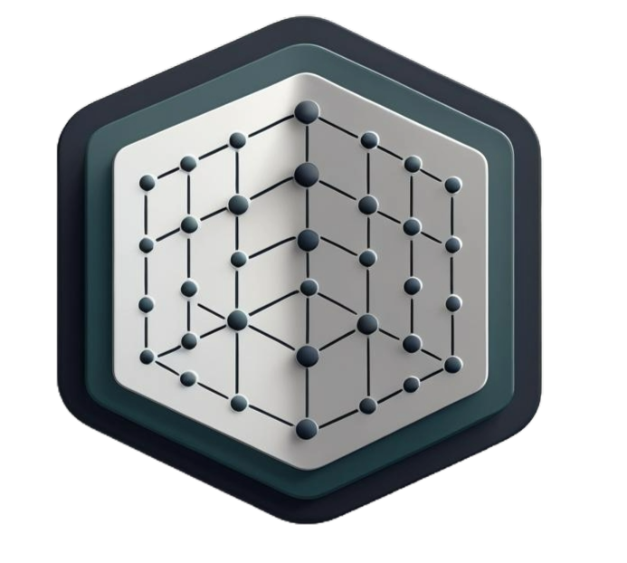
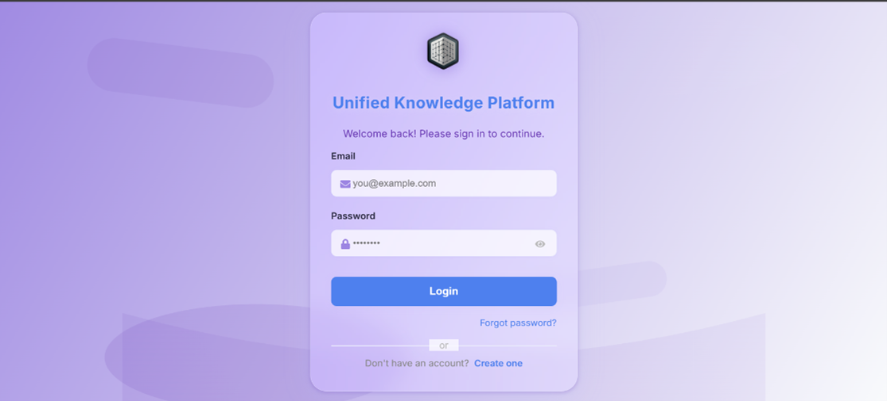
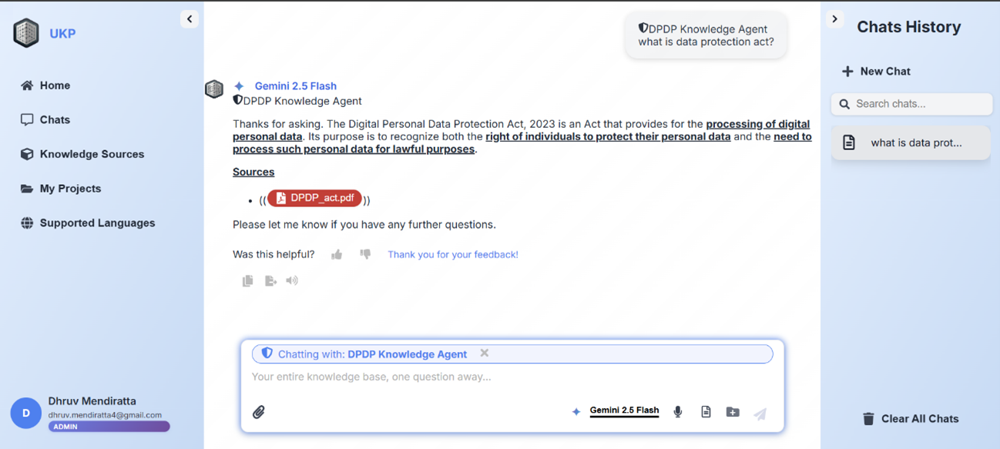
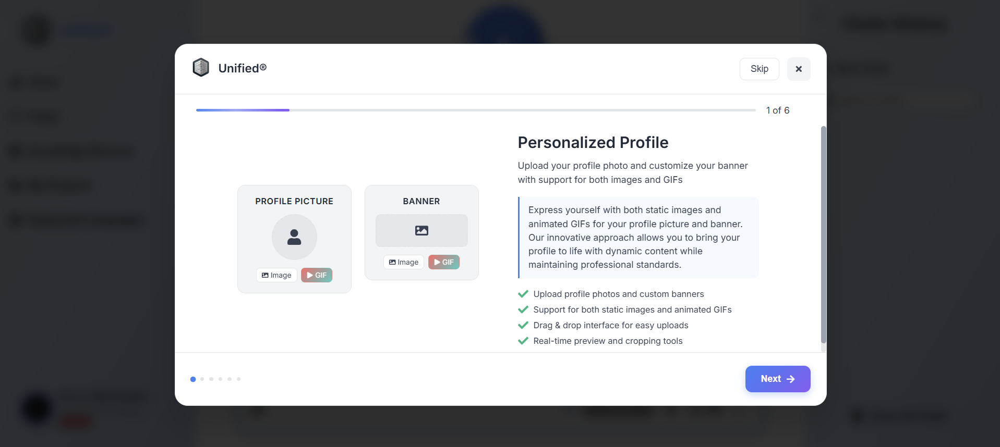
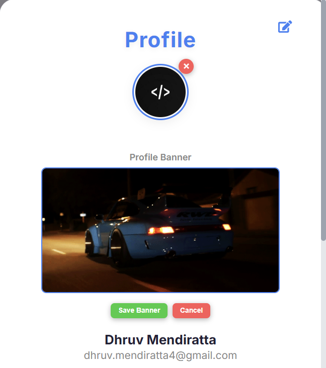
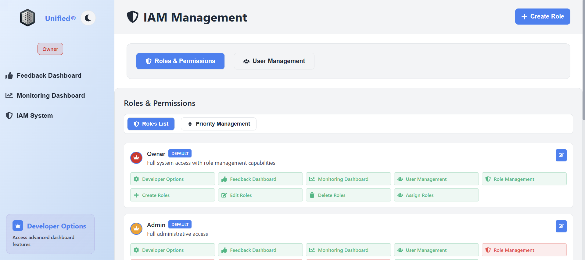

# 🚀 Unified Knowledge Platform (Unified®) 🚀

<div align="center">
  
  <!-- Animated Logo with Glow Effect -->
  <div style="position: relative; display: inline-block;">
    
  </div>

  <!-- Main Title with Gradient Text -->
  <h1 style="background: linear-gradient(45deg, #ff6b6b, #4ecdc4, #45b7d1, #96ceb4, #feca57, #ff9ff3, #54a0ff); background-size: 400% 400%; -webkit-background-clip: text; -webkit-text-fill-color: transparent; animation: gradient 3s ease infinite; font-size: 3.5em; margin: 20px 0; text-shadow: 2px 2px 4px rgba(0,0,0,0.3);">
    Unified® Knowledge Platform
  </h1>

  <!-- Subtitle with Typewriter Effect -->
  <p style="font-size: 1.5em; color: #666; margin: 10px 0 30px 0; font-weight: 300;">
    <span style="color: #00ff88; font-weight: bold;">AI-Powered</span> Knowledge Management & Retrieval System
  </p>

  <!-- Animated Badges with Hover Effects -->
  <div style="display: flex; justify-content: center; gap: 15px; flex-wrap: wrap; margin: 30px 0;">
    <a href="https://python.org" style="text-decoration: none;">
      
    </a>
    <a href="https://reactjs.org" style="text-decoration: none;">
      
    </a>
    <a href="https://flask.palletsprojects.com" style="text-decoration: none;">
      
    </a>
    <a href="LICENSE" style="text-decoration: none;">
      
    </a>
  </div>

  <!-- Floating Action Buttons -->
  <div style="display: flex; justify-content: center; gap: 20px; margin: 30px 0;">
    <a href="#overview" style="background: linear-gradient(45deg, #ff6b6b, #ee5a24); color: white; padding: 12px 24px; border-radius: 25px; text-decoration: none; font-weight: bold; box-shadow: 0 4px 15px rgba(255,107,107,0.4); transition: all 0.3s ease;">
      🚀 Get Started
    </a>
    <a href="#features" style="background: linear-gradient(45deg, #4ecdc4, #44a08d); color: white; padding: 12px 24px; border-radius: 25px; text-decoration: none; font-weight: bold; box-shadow: 0 4px 15px rgba(78,205,196,0.4); transition: all 0.3s ease;">
      ✨ Features
    </a>
    <a href="#demo" style="background: linear-gradient(45deg, #45b7d1, #96c93d); color: white; padding: 12px 24px; border-radius: 25px; text-decoration: none; font-weight: bold; box-shadow: 0 4px 15px rgba(69,183,209,0.4); transition: all 0.3s ease;">
      🎬 Demo
    </a>
  </div>

  <!-- Animated Stats -->
  <div style="display: flex; justify-content: center; gap: 40px; margin: 40px 0; flex-wrap: wrap;">
    <div style="text-align: center; padding: 20px; background: linear-gradient(135deg, rgba(255,255,255,0.1), rgba(255,255,255,0.05)); border-radius: 15px; backdrop-filter: blur(10px); border: 1px solid rgba(255,255,255,0.2);">
      <div style="font-size: 2.5em; font-weight: bold; color: #00ff88; margin-bottom: 5px;">🤖</div>
      <div style="font-size: 1.2em; color: #333; font-weight: bold;">Multi-LLM</div>
      <div style="color: #666; font-size: 0.9em;">Gemini, Llama3, Mistral</div>
    </div>
    <div style="text-align: center; padding: 20px; background: linear-gradient(135deg, rgba(255,255,255,0.1), rgba(255,255,255,0.05)); border-radius: 15px; backdrop-filter: blur(10px); border: 1px solid rgba(255,255,255,0.2);">
      <div style="font-size: 2.5em; font-weight: bold; color: #ff6b6b; margin-bottom: 5px;">🎯</div>
      <div style="font-size: 1.2em; color: #333; font-weight: bold;">RAG-Powered</div>
      <div style="color: #666; font-size: 0.9em;">Accurate Responses</div>
    </div>
    <div style="text-align: center; padding: 20px; background: linear-gradient(135deg, rgba(255,255,255,0.1), rgba(255,255,255,0.05)); border-radius: 15px; backdrop-filter: blur(10px); border: 1px solid rgba(255,255,255,0.2);">
      <div style="font-size: 2.5em; font-weight: bold; color: #4ecdc4; margin-bottom: 5px;">🎨</div>
      <div style="font-size: 1.2em; color: #333; font-weight: bold;">Modern UI/UX</div>
      <div style="color: #666; font-size: 0.9em;">Beautiful Design</div>
    </div>
    <div style="text-align: center; padding: 20px; background: linear-gradient(135deg, rgba(255,255,255,0.1), rgba(255,255,255,0.05)); border-radius: 15px; backdrop-filter: blur(10px); border: 1px solid rgba(255,255,255,0.2);">
      <div style="font-size: 2.5em; font-weight: bold; color: #45b7d1; margin-bottom: 5px;">🎤</div>
      <div style="font-size: 1.2em; color: #333; font-weight: bold;">Voice Integration</div>
      <div style="color: #666; font-size: 0.9em;">Hands-free Chat</div>
    </div>
  </div>

</div>

<!-- CSS Animations -->
<style>
@keyframes pulse {
  0% { transform: scale(1); }
  50% { transform: scale(1.05); }
  100% { transform: scale(1); }
}

@keyframes gradient {
  0% { background-position: 0% 50%; }
  50% { background-position: 100% 50%; }
  100% { background-position: 0% 50%; }
}

@keyframes float {
  0% { transform: translateY(0px); }
  50% { transform: translateY(-10px); }
  100% { transform: translateY(0px); }
}

/* Hover effects for badges */
img[src*="badge"]:hover {
  transform: translateY(-5px) scale(1.05);
  filter: drop-shadow(0 8px 16px rgba(0,0,0,0.3));
}

/* Hover effects for buttons */
a[href="#overview"]:hover, a[href="#features"]:hover, a[href="#demo"]:hover {
  transform: translateY(-3px);
  box-shadow: 0 8px 25px rgba(0,0,0,0.3);
}

/* Floating animation for stats */
div[style*="backdrop-filter"] {
  animation: float 3s ease-in-out infinite;
}
</style>

---

---

## 🌟 Overview

<div align="center">
  <div style="background: linear-gradient(135deg, #667eea 0%, #764ba2 100%); padding: 40px; border-radius: 20px; margin: 30px 0; box-shadow: 0 20px 40px rgba(0,0,0,0.1);">
    <h2 style="color: white; font-size: 2.5em; margin-bottom: 20px; text-shadow: 2px 2px 4px rgba(0,0,0,0.3);">
      🚀 The Future of Knowledge Management is Here! 🚀
    </h2>
    <p style="color: white; font-size: 1.3em; line-height: 1.6; margin-bottom: 30px;">
      The <strong>Unified Knowledge Platform (Unified®)</strong> is a revolutionary AI-powered web application that transforms how you interact with knowledge. 
      Built with cutting-edge technologies, it provides seamless access to internal knowledge sources through natural language queries with mind-blowing features!
    </p>
    
    <!-- Animated Feature Cards -->
    <div style="display: grid; grid-template-columns: repeat(auto-fit, minmax(250px, 1fr)); gap: 20px; margin-top: 30px;">
      <div style="background: rgba(255,255,255,0.1); padding: 25px; border-radius: 15px; backdrop-filter: blur(10px); border: 1px solid rgba(255,255,255,0.2); transition: transform 0.3s ease;">
        <div style="font-size: 3em; margin-bottom: 15px;">🤖</div>
        <h3 style="color: white; margin-bottom: 10px;">Multi-LLM Support</h3>
        <p style="color: rgba(255,255,255,0.9);">Gemini, Llama3, Mistral, and more - choose your AI companion!</p>
      </div>
      
      <div style="background: rgba(255,255,255,0.1); padding: 25px; border-radius: 15px; backdrop-filter: blur(10px); border: 1px solid rgba(255,255,255,0.2); transition: transform 0.3s ease;">
        <div style="font-size: 3em; margin-bottom: 15px;">🎯</div>
        <h3 style="color: white; margin-bottom: 10px;">RAG-Powered</h3>
        <p style="color: rgba(255,255,255,0.9);">Retrieval-Augmented Generation for pinpoint accurate responses!</p>
      </div>
      
      <div style="background: rgba(255,255,255,0.1); padding: 25px; border-radius: 15px; backdrop-filter: blur(10px); border: 1px solid rgba(255,255,255,0.2); transition: transform 0.3s ease;">
        <div style="font-size: 3em; margin-bottom: 15px;">🎨</div>
        <h3 style="color: white; margin-bottom: 10px;">Modern UI/UX</h3>
        <p style="color: rgba(255,255,255,0.9);">Beautiful, responsive design with stunning dark/light themes!</p>
      </div>
      
      <div style="background: rgba(255,255,255,0.1); padding: 25px; border-radius: 15px; backdrop-filter: blur(10px); border: 1px solid rgba(255,255,255,0.2); transition: transform 0.3s ease;">
        <div style="font-size: 3em; margin-bottom: 15px;">🎤</div>
        <h3 style="color: white; margin-bottom: 10px;">Voice Integration</h3>
        <p style="color: rgba(255,255,255,0.9);">ElevenLabs TTS/STT for hands-free interaction!</p>
      </div>
      
      <div style="background: rgba(255,255,255,0.1); padding: 25px; border-radius: 15px; backdrop-filter: blur(10px); border: 1px solid rgba(255,255,255,0.2); transition: transform 0.3s ease;">
        <div style="font-size: 3em; margin-bottom: 15px;">📱</div>
        <h3 style="color: white; margin-bottom: 10px;">User Management</h3>
        <p style="color: rgba(255,255,255,0.9);">Complete authentication, profiles, and permissions!</p>
      </div>
      
      <div style="background: rgba(255,255,255,0.1); padding: 25px; border-radius: 15px; backdrop-filter: blur(10px); border: 1px solid rgba(255,255,255,0.2); transition: transform 0.3s ease;">
        <div style="font-size: 3em; margin-bottom: 15px;">🔄</div>
        <h3 style="color: white; margin-bottom: 10px;">Real-time Chat</h3>
        <p style="color: rgba(255,255,255,0.9);">Multi-session conversations with source citations!</p>
      </div>
    </div>
  </div>
</div>

<style>
/* Hover effects for feature cards */
div[style*="backdrop-filter"]:hover {
  transform: translateY(-10px) scale(1.02);
  box-shadow: 0 15px 30px rgba(0,0,0,0.2);
}
</style>

---

## 🏗️ Architecture

<div align="center">
  <div style="background: linear-gradient(135deg, #f093fb 0%, #f5576c 100%); padding: 40px; border-radius: 20px; margin: 30px 0; box-shadow: 0 20px 40px rgba(0,0,0,0.1);">
    <h2 style="color: white; font-size: 2.5em; margin-bottom: 30px; text-shadow: 2px 2px 4px rgba(0,0,0,0.3);">
      🏛️ Revolutionary System Architecture 🏛️
    </h2>
    
    <!-- Interactive Architecture Diagram -->
    <div style="display: grid; grid-template-columns: repeat(3, 1fr); gap: 20px; margin: 30px 0;">
      
      <!-- React Frontend -->
      <div style="background: rgba(255,255,255,0.15); padding: 25px; border-radius: 15px; backdrop-filter: blur(10px); border: 2px solid rgba(255,255,255,0.3); text-align: center; transition: all 0.3s ease;">
        <div style="font-size: 4em; margin-bottom: 15px;">⚛️</div>
        <h3 style="color: white; font-size: 1.5em; margin-bottom: 15px;">React Frontend</h3>
        <ul style="color: rgba(255,255,255,0.9); text-align: left; list-style: none; padding: 0;">
          <li style="margin: 8px 0; padding: 5px 10px; background: rgba(255,255,255,0.1); border-radius: 8px;">🎨 Chat Interface</li>
          <li style="margin: 8px 0; padding: 5px 10px; background: rgba(255,255,255,0.1); border-radius: 8px;">🔐 User Auth</li>
          <li style="margin: 8px 0; padding: 5px 10px; background: rgba(255,255,255,0.1); border-radius: 8px;">🎤 Voice Features</li>
          <li style="margin: 8px 0; padding: 5px 10px; background: rgba(255,255,255,0.1); border-radius: 8px;">👤 Profile Mgmt</li>
        </ul>
      </div>
      
      <!-- Flask Backend -->
      <div style="background: rgba(255,255,255,0.15); padding: 25px; border-radius: 15px; backdrop-filter: blur(10px); border: 2px solid rgba(255,255,255,0.3); text-align: center; transition: all 0.3s ease;">
        <div style="font-size: 4em; margin-bottom: 15px;">🐍</div>
        <h3 style="color: white; font-size: 1.5em; margin-bottom: 15px;">Flask Backend</h3>
        <ul style="color: rgba(255,255,255,0.9); text-align: left; list-style: none; padding: 0;">
          <li style="margin: 8px 0; padding: 5px 10px; background: rgba(255,255,255,0.1); border-radius: 8px;">🎯 RAG Pipeline</li>
          <li style="margin: 8px 0; padding: 5px 10px; background: rgba(255,255,255,0.1); border-radius: 8px;">📊 Session Mgmt</li>
          <li style="margin: 8px 0; padding: 5px 10px; background: rgba(255,255,255,0.1); border-radius: 8px;">📄 PDF Processing</li>
          <li style="margin: 8px 0; padding: 5px 10px; background: rgba(255,255,255,0.1); border-radius: 8px;">🤖 Agent System</li>
        </ul>
      </div>
      
      <!-- LLM Services -->
      <div style="background: rgba(255,255,255,0.15); padding: 25px; border-radius: 15px; backdrop-filter: blur(10px); border: 2px solid rgba(255,255,255,0.3); text-align: center; transition: all 0.3s ease;">
        <div style="font-size: 4em; margin-bottom: 15px;">🧠</div>
        <h3 style="color: white; font-size: 1.5em; margin-bottom: 15px;">LLM Services</h3>
        <ul style="color: rgba(255,255,255,0.9); text-align: left; list-style: none; padding: 0;">
          <li style="margin: 8px 0; padding: 5px 10px; background: rgba(255,255,255,0.1); border-radius: 8px;">🔮 Gemini API</li>
          <li style="margin: 8px 0; padding: 5px 10px; background: rgba(255,255,255,0.1); border-radius: 8px;">🦙 Llama3 Local</li>
          <li style="margin: 8px 0; padding: 5px 10px; background: rgba(255,255,255,0.1); border-radius: 8px;">🌪️ Mistral API</li>
          <li style="margin: 8px 0; padding: 5px 10px; background: rgba(255,255,255,0.1); border-radius: 8px;">⚙️ Custom Models</li>
        </ul>
      </div>
    </div>
    
    <!-- Data Layer -->
    <div style="display: grid; grid-template-columns: repeat(3, 1fr); gap: 20px; margin-top: 30px;">
      
      <!-- LocalStorage -->
      <div style="background: rgba(255,255,255,0.1); padding: 20px; border-radius: 12px; backdrop-filter: blur(10px); border: 1px solid rgba(255,255,255,0.2); text-align: center;">
        <div style="font-size: 2.5em; margin-bottom: 10px;">💾</div>
        <h4 style="color: white; margin-bottom: 10px;">LocalStorage</h4>
        <p style="color: rgba(255,255,255,0.8); font-size: 0.9em;">User Data • Chat History • Settings</p>
      </div>
      
      <!-- File System -->
      <div style="background: rgba(255,255,255,0.1); padding: 20px; border-radius: 12px; backdrop-filter: blur(10px); border: 1px solid rgba(255,255,255,0.2); text-align: center;">
        <div style="font-size: 2.5em; margin-bottom: 10px;">📁</div>
        <h4 style="color: white; margin-bottom: 10px;">File System</h4>
        <p style="color: rgba(255,255,255,0.8); font-size: 0.9em;">PDF Documents • Profile Images • Banner Files</p>
      </div>
      
      <!-- Vector DB -->
      <div style="background: rgba(255,255,255,0.1); padding: 20px; border-radius: 12px; backdrop-filter: blur(10px); border: 1px solid rgba(255,255,255,0.2); text-align: center;">
        <div style="font-size: 2.5em; margin-bottom: 10px;">🔍</div>
        <h4 style="color: white; margin-bottom: 10px;">Vector DB</h4>
        <p style="color: rgba(255,255,255,0.8); font-size: 0.9em;">FAISS Index • Embeddings • Search Index</p>
      </div>
    </div>
    
    <!-- Connection Lines -->
    <div style="position: relative; height: 20px; margin: 20px 0;">
      <div style="position: absolute; top: 50%; left: 0; right: 0; height: 2px; background: linear-gradient(90deg, transparent, rgba(255,255,255,0.5), transparent);"></div>
    </div>
    
  </div>
</div>

<style>
/* Architecture hover effects */
div[style*="backdrop-filter"]:hover {
  transform: translateY(-5px) scale(1.02);
  box-shadow: 0 15px 30px rgba(0,0,0,0.2);
  border-color: rgba(255,255,255,0.5);
}

/* Animated connection lines */
div[style*="background: linear-gradient(90deg, transparent, rgba(255,255,255,0.5), transparent)"] {
  animation: pulse 2s ease-in-out infinite;
}
</style>

---

## 🎯 Core Features

<div align="center">
  <div style="background: linear-gradient(135deg, #667eea 0%, #764ba2 100%); padding: 40px; border-radius: 20px; margin: 30px 0; box-shadow: 0 20px 40px rgba(0,0,0,0.1);">
    <h2 style="color: white; font-size: 2.5em; margin-bottom: 30px; text-shadow: 2px 2px 4px rgba(0,0,0,0.3);">
      ⚡ Mind-Blowing Features That Will Amaze You! ⚡
    </h2>
    
    <!-- Feature Categories Grid -->
    <div style="display: grid; grid-template-columns: repeat(auto-fit, minmax(300px, 1fr)); gap: 25px; margin-top: 30px;">
      
      <!-- AI & Intelligence -->
      <div style="background: rgba(255,255,255,0.1); padding: 30px; border-radius: 20px; backdrop-filter: blur(10px); border: 2px solid rgba(255,255,255,0.2); transition: all 0.3s ease;">
        <div style="text-align: center; margin-bottom: 20px;">
          <div style="font-size: 4em; margin-bottom: 15px;">🤖</div>
          <h3 style="color: white; font-size: 1.8em; margin-bottom: 20px;">AI & Intelligence</h3>
        </div>
        <ul style="color: rgba(255,255,255,0.9); list-style: none; padding: 0;">
          <li style="margin: 15px 0; padding: 12px 15px; background: rgba(255,255,255,0.1); border-radius: 10px; border-left: 4px solid #00ff88;">
            <strong>🔮 Multi-Model LLM Support</strong><br>
            <span style="font-size: 0.9em;">Seamlessly switch between Gemini, Llama3, Mistral, and custom models</span>
          </li>
          <li style="margin: 15px 0; padding: 12px 15px; background: rgba(255,255,255,0.1); border-radius: 10px; border-left: 4px solid #ff6b6b;">
            <strong>🎯 RAG Pipeline</strong><br>
            <span style="font-size: 0.9em;">Retrieval-Augmented Generation for contextually accurate responses</span>
          </li>
          <li style="margin: 15px 0; padding: 12px 15px; background: rgba(255,255,255,0.1); border-radius: 10px; border-left: 4px solid #4ecdc4;">
            <strong>📚 Source Citation</strong><br>
            <span style="font-size: 0.9em;">Direct links to source documents with text highlighting</span>
          </li>
          <li style="margin: 15px 0; padding: 12px 15px; background: rgba(255,255,255,0.1); border-radius: 10px; border-left: 4px solid #45b7d1;">
            <strong>🧠 Context Awareness</strong><br>
            <span style="font-size: 0.9em;">Intelligent conversation memory and context management</span>
          </li>
        </ul>
      </div>
      
      <!-- Advanced Chat System -->
      <div style="background: rgba(255,255,255,0.1); padding: 30px; border-radius: 20px; backdrop-filter: blur(10px); border: 2px solid rgba(255,255,255,0.2); transition: all 0.3s ease;">
        <div style="text-align: center; margin-bottom: 20px;">
          <div style="font-size: 4em; margin-bottom: 15px;">💬</div>
          <h3 style="color: white; font-size: 1.8em; margin-bottom: 20px;">Advanced Chat System</h3>
        </div>
        <ul style="color: rgba(255,255,255,0.9); list-style: none; padding: 0;">
          <li style="margin: 15px 0; padding: 12px 15px; background: rgba(255,255,255,0.1); border-radius: 10px; border-left: 4px solid #96ceb4;">
            <strong>🔄 Multi-Session Support</strong><br>
            <span style="font-size: 0.9em;">Manage multiple conversation threads simultaneously</span>
          </li>
          <li style="margin: 15px 0; padding: 12px 15px; background: rgba(255,255,255,0.1); border-radius: 10px; border-left: 4px solid #feca57;">
            <strong>⚡ Real-time Streaming</strong><br>
            <span style="font-size: 0.9em;">Live response generation with typing indicators</span>
          </li>
          <li style="margin: 15px 0; padding: 12px 15px; background: rgba(255,255,255,0.1); border-radius: 10px; border-left: 4px solid #ff9ff3;">
            <strong>📜 Message History</strong><br>
            <span style="font-size: 0.9em;">Persistent chat history with export capabilities</span>
          </li>
          <li style="margin: 15px 0; padding: 12px 15px; background: rgba(255,255,255,0.1); border-radius: 10px; border-left: 4px solid #54a0ff;">
            <strong>🎤 Voice Interaction</strong><br>
            <span style="font-size: 0.9em;">Speak to chat and hear responses with ElevenLabs</span>
          </li>
        </ul>
      </div>
      
      <!-- User Management -->
      <div style="background: rgba(255,255,255,0.1); padding: 30px; border-radius: 20px; backdrop-filter: blur(10px); border: 2px solid rgba(255,255,255,0.2); transition: all 0.3s ease;">
        <div style="text-align: center; margin-bottom: 20px;">
          <div style="font-size: 4em; margin-bottom: 15px;">👤</div>
          <h3 style="color: white; font-size: 1.8em; margin-bottom: 20px;">User Management</h3>
        </div>
        <ul style="color: rgba(255,255,255,0.9); list-style: none; padding: 0;">
          <li style="margin: 15px 0; padding: 12px 15px; background: rgba(255,255,255,0.1); border-radius: 10px; border-left: 4px solid #ff6b6b;">
            <strong>🔐 Secure Authentication</strong><br>
            <span style="font-size: 0.9em;">Email/password and OTP-based account creation</span>
          </li>
          <li style="margin: 15px 0; padding: 12px 15px; background: rgba(255,255,255,0.1); border-radius: 10px; border-left: 4px solid #4ecdc4;">
            <strong>🎨 Profile Customization</strong><br>
            <span style="font-size: 0.9em;">Upload profile pictures and banners (supports GIFs!)</span>
          </li>
          <li style="margin: 15px 0; padding: 12px 15px; background: rgba(255,255,255,0.1); border-radius: 10px; border-left: 4px solid #45b7d1;">
            <strong>👑 Role-Based Access</strong><br>
            <span style="font-size: 0.9em;">Admin, Developer, and User permission levels</span>
          </li>
          <li style="margin: 15px 0; padding: 12px 15px; background: rgba(255,255,255,0.1); border-radius: 10px; border-left: 4px solid #96ceb4;">
            <strong>🔒 Session Management</strong><br>
            <span style="font-size: 0.9em;">Secure login/logout with session persistence</span>
          </li>
        </ul>
      </div>
      
      <!-- Modern Interface -->
      <div style="background: rgba(255,255,255,0.1); padding: 30px; border-radius: 20px; backdrop-filter: blur(10px); border: 2px solid rgba(255,255,255,0.2); transition: all 0.3s ease;">
        <div style="text-align: center; margin-bottom: 20px;">
          <div style="font-size: 4em; margin-bottom: 15px;">🎨</div>
          <h3 style="color: white; font-size: 1.8em; margin-bottom: 20px;">Modern Interface</h3>
        </div>
        <ul style="color: rgba(255,255,255,0.9); list-style: none; padding: 0;">
          <li style="margin: 15px 0; padding: 12px 15px; background: rgba(255,255,255,0.1); border-radius: 10px; border-left: 4px solid #feca57;">
            <strong>📱 Responsive Design</strong><br>
            <span style="font-size: 0.9em;">Works perfectly on desktop, tablet, and mobile</span>
          </li>
          <li style="margin: 15px 0; padding: 12px 15px; background: rgba(255,255,255,0.1); border-radius: 10px; border-left: 4px solid #ff9ff3;">
            <strong>🌙 Theme Support</strong><br>
            <span style="font-size: 0.9em;">Beautiful light and dark mode themes</span>
          </li>
          <li style="margin: 15px 0; padding: 12px 15px; background: rgba(255,255,255,0.1); border-radius: 10px; border-left: 4px solid #54a0ff;">
            <strong>♿ Accessibility</strong><br>
            <span style="font-size: 0.9em;">Keyboard navigation and screen reader support</span>
          </li>
          <li style="margin: 15px 0; padding: 12px 15px; background: rgba(255,255,255,0.1); border-radius: 10px; border-left: 4px solid #00ff88;">
            <strong>✨ Animations</strong><br>
            <span style="font-size: 0.9em;">Smooth transitions and micro-interactions</span>
          </li>
        </ul>
      </div>
      
      <!-- Document Intelligence -->
      <div style="background: rgba(255,255,255,0.1); padding: 30px; border-radius: 20px; backdrop-filter: blur(10px); border: 2px solid rgba(255,255,255,0.2); transition: all 0.3s ease;">
        <div style="text-align: center; margin-bottom: 20px;">
          <div style="font-size: 4em; margin-bottom: 15px;">📄</div>
          <h3 style="color: white; font-size: 1.8em; margin-bottom: 20px;">Document Intelligence</h3>
        </div>
        <ul style="color: rgba(255,255,255,0.9); list-style: none; padding: 0;">
          <li style="margin: 15px 0; padding: 12px 15px; background: rgba(255,255,255,0.1); border-radius: 10px; border-left: 4px solid #ff6b6b;">
            <strong>🔍 PDF Processing</strong><br>
            <span style="font-size: 0.9em;">Advanced text extraction and vectorization</span>
          </li>
          <li style="margin: 15px 0; padding: 12px 15px; background: rgba(255,255,255,0.1); border-radius: 10px; border-left: 4px solid #4ecdc4;">
            <strong>✨ Source Highlighting</strong><br>
            <span style="font-size: 0.9em;">Direct links to relevant document sections</span>
          </li>
          <li style="margin: 15px 0; padding: 12px 15px; background: rgba(255,255,255,0.1); border-radius: 10px; border-left: 4px solid #45b7d1;">
            <strong>📖 Document Viewer</strong><br>
            <span style="font-size: 0.9em;">Built-in PDF viewer with page navigation</span>
          </li>
          <li style="margin: 15px 0; padding: 12px 15px; background: rgba(255,255,255,0.1); border-radius: 10px; border-left: 4px solid #96ceb4;">
            <strong>📁 Multi-Format Support</strong><br>
            <span style="font-size: 0.9em;">PDF, DOCX, CSV, and more formats</span>
          </li>
        </ul>
      </div>
      
    </div>
    
    <!-- Feature Stats -->
    <div style="display: grid; grid-template-columns: repeat(auto-fit, minmax(200px, 1fr)); gap: 20px; margin-top: 40px;">
      <div style="text-align: center; padding: 20px; background: rgba(255,255,255,0.1); border-radius: 15px; backdrop-filter: blur(10px); border: 1px solid rgba(255,255,255,0.2);">
        <div style="font-size: 3em; color: #00ff88; margin-bottom: 10px;">🚀</div>
        <div style="font-size: 2em; color: white; font-weight: bold; margin-bottom: 5px;">20+</div>
        <div style="color: rgba(255,255,255,0.8);">Amazing Features</div>
      </div>
      <div style="text-align: center; padding: 20px; background: rgba(255,255,255,0.1); border-radius: 15px; backdrop-filter: blur(10px); border: 1px solid rgba(255,255,255,0.2);">
        <div style="font-size: 3em; color: #ff6b6b; margin-bottom: 10px;">🤖</div>
        <div style="font-size: 2em; color: white; font-weight: bold; margin-bottom: 5px;">4+</div>
        <div style="color: rgba(255,255,255,0.8);">AI Models</div>
      </div>
      <div style="text-align: center; padding: 20px; background: rgba(255,255,255,0.1); border-radius: 15px; backdrop-filter: blur(10px); border: 1px solid rgba(255,255,255,0.2);">
        <div style="font-size: 3em; color: #4ecdc4; margin-bottom: 10px;">📄</div>
        <div style="font-size: 2em; color: white; font-weight: bold; margin-bottom: 5px;">10+</div>
        <div style="color: rgba(255,255,255,0.8);">File Formats</div>
      </div>
      <div style="text-align: center; padding: 20px; background: rgba(255,255,255,0.1); border-radius: 15px; backdrop-filter: blur(10px); border: 1px solid rgba(255,255,255,0.2);">
        <div style="font-size: 3em; color: #45b7d1; margin-bottom: 10px;">⚡</div>
        <div style="font-size: 2em; color: white; font-weight: bold; margin-bottom: 5px;">100%</div>
        <div style="color: rgba(255,255,255,0.8);">Responsive</div>
      </div>
    </div>
    
  </div>
</div>

<style>
/* Feature cards hover effects */
div[style*="backdrop-filter"]:hover {
  transform: translateY(-10px) scale(1.02);
  box-shadow: 0 20px 40px rgba(0,0,0,0.2);
  border-color: rgba(255,255,255,0.4);
}

/* Feature list items hover */
li[style*="border-left: 4px solid"]:hover {
  background: rgba(255,255,255,0.2) !important;
  transform: translateX(5px);
  transition: all 0.3s ease;
}

/* Stats cards animation */
div[style*="text-align: center; padding: 20px"] {
  animation: float 3s ease-in-out infinite;
}

div[style*="text-align: center; padding: 20px"]:nth-child(2) {
  animation-delay: 0.5s;
}

div[style*="text-align: center; padding: 20px"]:nth-child(3) {
  animation-delay: 1s;
}

div[style*="text-align: center; padding: 20px"]:nth-child(4) {
  animation-delay: 1.5s;
}
</style>

---

## 🛠️ Technology Stack

### Frontend
- **React 18** - Modern UI framework
- **CSS3** - Custom styling with CSS variables
- **React Icons** - Beautiful icon library
- **LocalStorage** - Client-side data persistence

### Backend
- **Flask** - Python web framework
- **FAISS** - Vector similarity search
- **LangChain** - LLM orchestration
- **PyPDF2** - PDF processing
- **ElevenLabs** - Voice synthesis

### AI & ML
- **Google Gemini** - Primary LLM
- **Meta Llama3** - Local LLM option
- **Mistral AI** - Alternative LLM
- **Sentence Transformers** - Text embeddings

### Infrastructure
- **Python 3.9+** - Backend runtime
- **Node.js 16+** - Frontend runtime
- **Git** - Version control
- **Environment Variables** - Secure configuration

---

## 📦 Installation & Setup

### Prerequisites
- **Python 3.9+** with pip
- **Node.js 16+** with npm
- **Git** for version control
- **API Keys** for external services

### 1. Clone Repository
```bash
git clone <your-repo-url>
cd EY_RAG_Project
```

### 2. Backend Setup
```bash
# Create virtual environment
python -m venv venv
source venv/bin/activate  # Windows: venv\Scripts\activate

# Install dependencies
pip install -r requirements.txt
cd backend
pip install -r requirements.txt
cd ..
```

### 3. Frontend Setup
```bash
cd react-frontend
npm install
```

### 4. Environment Configuration
Create a `.env` file in the project root:
```env
# API Keys
GOOGLE_API_KEY=your_gemini_api_key_here
ELEVENLABS_API_KEY=your_elevenlabs_api_key_here
SARVAM_API_KEY=your_sarvam_api_key_here
FLASK_SECRET_KEY=your_flask_secret_key_here

# Application Settings
MAX_CONVERSATION_HISTORY=10
DEBUG_MODE=true
```

### 5. Document Setup
```bash
# Place your PDF documents in the backend/pdfs/ directory
mkdir -p backend/pdfs
# Copy your documents: DPDP_act.pdf, Rules_of_Procedures_Lok_Sabha.pdf, etc.
```

---

## 🚀 Running the Application

### Start Backend Server
```bash
python backend.py
```
Backend will be available at `http://localhost:5000`

### Start Frontend Development Server
```bash
cd react-frontend
npm start
```
Frontend will be available at `http://localhost:3000`

### Production Build
```bash
cd react-frontend
npm run build
```

---

## 🎮 Usage Guide

### 🔐 **Getting Started**
1. **Create Account**: Use the registration form with email verification
2. **Welcome Tour**: New users get an interactive welcome overlay
3. **Profile Setup**: Upload your profile picture and banner
4. **Start Chatting**: Begin asking questions about your documents

### 💬 **Chat Interface**
- **Ask Questions**: Type natural language queries
- **Mention Agents**: Use `@AgentName` to specify knowledge sources
- **Voice Input**: Click the microphone for voice queries
- **Quick Actions**: Use predefined templates for common tasks

### 👤 **User Features**
- **Profile Management**: Update your profile picture and banner
- **Theme Switching**: Toggle between light and dark modes
- **Session Management**: View and manage your chat sessions
- **Export Data**: Download chat history and responses

### 🔧 **Admin Features**
- **User Management**: View and manage user accounts
- **Developer Options**: Access advanced features and debugging
- **System Monitoring**: View usage analytics and performance

---

## 📁 Project Structure

```
EY_RAG_Project/
├── 📁 backend/                    # Backend Python application
│   ├── 📁 pdfs/                   # Source PDF documents
│   ├── 📁 faiss_index/            # FAISS vector index files
│   ├── 📁 utils/                  # Utility modules
│   ├── 📄 pdf_utils.py            # PDF processing utilities
│   ├── 📄 RAGPipeline.py          # RAG pipeline implementation
│   ├── 📄 banner_utils.py         # Banner file management
│   ├── 📄 requirements.txt        # Backend dependencies
│   └── 📄 ...
├── 📁 react-frontend/             # React frontend application
│   ├── 📁 src/
│   │   ├── 📁 components/         # React components
│   │   │   ├── 📄 WelcomeOverlay.js    # Welcome tour component
│   │   │   ├── 📄 ProfileModal.js      # Profile management
│   │   │   ├── 📄 OTPVerification.js   # OTP verification
│   │   │   └── 📄 ...
│   │   ├── 📁 views/              # Page components
│   │   ├── 📁 styles/             # CSS stylesheets
│   │   ├── 📁 utils/              # Frontend utilities
│   │   └── 📄 App.js              # Main application component
│   ├── 📁 public/                 # Static assets
│   └── 📄 package.json            # Frontend dependencies
├── 📄 backend.py                  # Main Flask server
├── 📄 prompts.py                  # LLM prompt templates
├── 📄 requirements.txt            # Top-level dependencies
├── 📄 README.md                   # Project documentation
└── 📄 .env                        # Environment configuration
```

---

## 🆕 Recent Features & Updates

### 🎉 **Welcome Overlay System**
- **Interactive Tour**: New users get a beautiful 6-step welcome tour
- **Profile Setup**: Integrated profile picture and banner upload
- **GIF Support**: First platform to support animated GIFs for profiles
- **Auto-Save**: Images automatically save when proceeding through tour

### 🔐 **Enhanced Authentication**
- **OTP Verification**: Secure 6-digit OTP for account creation and deletion
- **Auto-Verification**: OTP automatically verifies when all digits are entered
- **Account Management**: Complete user lifecycle management
- **Security**: Proper session handling and data cleanup

### 🎨 **Profile Management**
- **Profile Pictures**: Upload and manage profile photos with compression
- **Banner Images**: Custom banner uploads with file system storage
- **GIF Support**: Animated GIFs for both profile and banner images
- **Theme Integration**: Seamless integration with light/dark themes

### 💬 **Advanced Chat Features**
- **Multi-Session**: Manage multiple conversation threads
- **Voice Integration**: ElevenLabs TTS/STT for voice interaction
- **Source Linking**: Direct links to source documents
- **Export Capabilities**: Download chat history and responses

### 🔧 **Developer Features**
- **Admin Panel**: Comprehensive user and system management
- **Debug Tools**: Testing utilities for welcome overlay and OTP
- **Monitoring**: Usage analytics and performance tracking
- **Role-Based Access**: Granular permission system

---

## 🎯 Key Screenshots

### 🏠 **Login & Authentication**

*Secure authentication with email/password and OTP verification*

### 💬 **Chat Interface**

*Modern chat interface with multi-session support and voice features*

### 🎨 **Welcome Overlay**

*Interactive welcome tour for new users with profile setup*

### 👤 **Profile Management**


*Complete profile customization with GIF support*

### 🔧 **Admin Dashboard**

*Comprehensive admin panel with user management*

---

## 🛠️ Development

### Adding New Features
1. **Frontend Components**: Add React components in `react-frontend/src/components/`
2. **Backend APIs**: Extend Flask routes in `backend.py`
3. **Styling**: Add CSS in `react-frontend/src/styles/`
4. **Testing**: Use admin tools for feature testing

### Code Style
- **Frontend**: React functional components with hooks
- **Backend**: Flask with proper error handling
- **Styling**: CSS variables for theme consistency
- **Documentation**: Comprehensive comments and README

### Debugging
- **Browser Console**: Frontend debugging
- **Flask Logs**: Backend debugging
- **Admin Tools**: Built-in testing utilities
- **Environment Variables**: Secure configuration management

---

## 🤝 Contributing

1. **Fork** the repository
2. **Create** a feature branch
3. **Make** your changes
4. **Test** thoroughly
5. **Submit** a pull request

### Development Guidelines
- Follow existing code style
- Add comprehensive documentation
- Test all features thoroughly
- Update README for new features

---

## 📄 License

This project uses a **Non-Commercial Software License** that protects the creator's rights while encouraging open collaboration.

### ✅ **What's Allowed:**
- Personal, educational, and non-commercial use
- Forking and modifying for personal/educational purposes  
- Contributing improvements and suggestions via pull requests
- Academic research and learning
- Open source collaboration and development
- Sharing and redistributing for non-commercial purposes
- Building upon the material for personal projects

### ❌ **What Requires Permission:**
- Commercial use of any kind
- Selling the software or derivative works
- Using in commercial products or services
- Generating revenue from the software
- Using in a business context
- Licensing to others for commercial purposes
- Integration into commercial applications

### 📧 **Requesting Commercial Permission:**
For commercial use, please contact:
- **Email**: dhruv.mendiratta4@gmail.com
- **GitHub**: [@dhruvm-18](https://github.com/dhruvm-18)
- **LinkedIn**: [Dhruv Mendiratta](www.linkedin.com/in/dhruvmendiratta18)

Include in your request:
- Intended use case and business model
- Company/organization details
- Expected user base and scale
- Revenue model and pricing (if applicable)
- Timeline for implementation
- Specific features you plan to use

**Full License**: See [LICENSE](LICENSE) file for complete details.

---

## 👨‍💻 Credits

**Developed by:** Dhruv Mendiratta

**Technologies Used:**
- Flask, React, LangChain, Gemini, FAISS, ElevenLabs
- Modern web technologies and AI/ML frameworks

**Special Thanks:**
- Google Gemini API for LLM capabilities
- ElevenLabs for voice synthesis
- Open source community for amazing tools

---

## 📞 Support

For support, questions, or feature requests:
- **Issues**: Create an issue on GitHub
- **Documentation**: Check this README and inline code comments
- **Development**: Use admin tools for testing and debugging

---

<div align="center">
  <p><strong>Unified® Knowledge Platform</strong></p>
  <p>Empowering knowledge discovery through AI</p>
</div>
