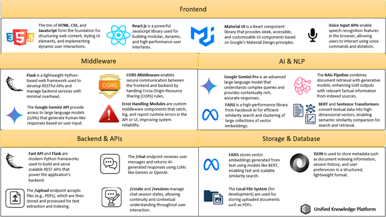
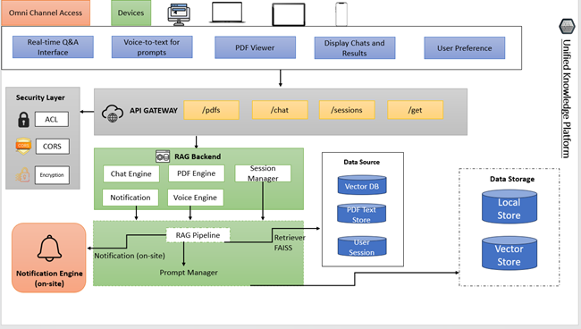

# Unified Knowledge Platform (UKP)

## Overview

The Unified Knowledge Platform (UKP) is an AI-powered web application for querying internal knowledge sources (legal documents, parliamentary rules, etc.) using natural language. It features:
- **Retrieval-Augmented Generation (RAG)** with support for multiple LLMs (Gemini, Llama3, Mistral, etc.)
- **Source-cited answers** with direct PDF linking and highlighting
- **Modern React frontend** with chat, agent selection, PDF viewing, and voice features

---

## Architecture

```
[React Frontend] <——> [Flask Backend API (RAG, LLMs, PDF, session)]
                                        |
                                        +——> [Gemini LLM]
                                        +——> [Llama3 (local)]
                                        +——> [Mistral (local)]
                                        ...
```
- **Frontend:** React SPA (chat, PDF, voice, agents)
- **Backend:** Flask API (session, message, PDF, agent management, LLM orchestration)




---

## Environment Setup

### Prerequisites
- Python 3.9+
- Node.js 16+ and npm
- pip
- git

### 1. Clone the Repository
```bash
git clone <your-repo-url>
cd EY_RAG_Project
```

### 2. Python Environment
```bash
python -m venv venv
source venv/bin/activate  # On Windows: venv\Scripts\activate
pip install -r requirements.txt
cd backend
pip install -r requirements.txt
```

### 3. Node/Frontend Environment
```bash
cd ../react-frontend
npm install
```

### 4. Environment Variables (.env)
Create a `.env` file in the project root with:
```env
# === API Keys ===
GOOGLE_API_KEY=your_gemini_api_key_here
ELEVENLABS_API_KEY=your_elevenlabs_api_key_here
SARVAM_API_KEY=your_sarvam_api_key_here
FLASK_SECRET_KEY=your_flask_secret_key_here
MAX_CONVERSATION_HISTORY=10
```
- **All API keys are loaded from .env.**
- No hardcoded keys remain in the codebase.

### 5. PDF Documents
- Place your PDFs in `backend/pdfs/` (e.g., `DPDP_act.pdf`, `Rules_of_Procedures_Lok_Sabha.pdf`)

---

## How to Run

### Start Backend API
```bash
python backend.py
```

### Start Frontend
```bash
cd react-frontend
npm start
```
- Open [http://localhost:3000](http://localhost:3000)

---

## Key Features
- **Multi-Model Support:** Gemini, Llama3, Mistral, etc. are handled directly in the backend.
- **Unified Prompt/Markdown Logic:** All prompt construction and markdown/source-link formatting is handled in the backend.
- **API Key Security:** All sensitive keys are loaded from `.env` only.
- **Session & Agent Management:** Multi-session chat, agent selection, and PDF source linking.
- **Voice Support:** ElevenLabs TTS/STT integration.

---


## Directory Structure
```
EY_RAG_Project/
├── backend/                  # Backend Python modules and data
│   ├── pdfs/                 # Source PDF documents
│   ├── faiss_index/          # FAISS vector index files
│   ├── pdf_utils.py          # PDF handling utilities
│   ├── RAGPipeline.py        # RAG pipeline logic
│   ├── utils.py              # FAISS index helpers
│   ├── requirements.txt      # Backend dependencies
│   └── ...
├── react-frontend/           # React frontend app
│   ├── src/
│   └── public/
├── prompts.py                # Prompt templates and instructions
├── backend.py                # Main Flask backend server (RAG, LLMs)
├── README.md                 # Project documentation (this file)
├── requirements.txt          # Top-level Python dependencies
└── ...
```

---

## Extending the Platform
- **Add new models:** Extend backend LLM logic in `backend.py` and `backend/utils.py`.
- **Add new knowledge sources:** Place new PDFs in `backend/pdfs/` and update agent definitions in the frontend.
- **Customize prompts:** Edit `prompts.py` for new instructions or formatting.
- **Improve retrieval:** Extend `backend/RAGPipeline.py` and `backend/utils.py` for advanced retrieval logic.

---

## API Reference
- See `docs/api-reference.md` for full backend API documentation.

---

## Credits
- Built with Flask, React, LangChain, Gemini, FAISS, ElevenLabs, and pdfjs-dist.
- Developed by Dhruv Mendiratta and contributors.
