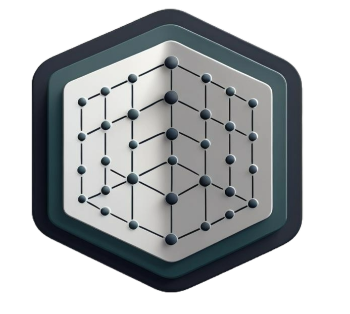
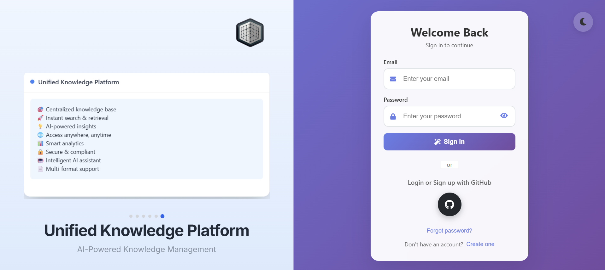
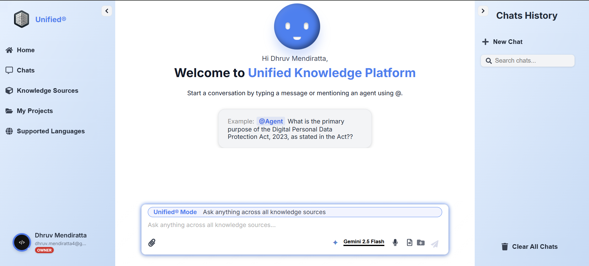
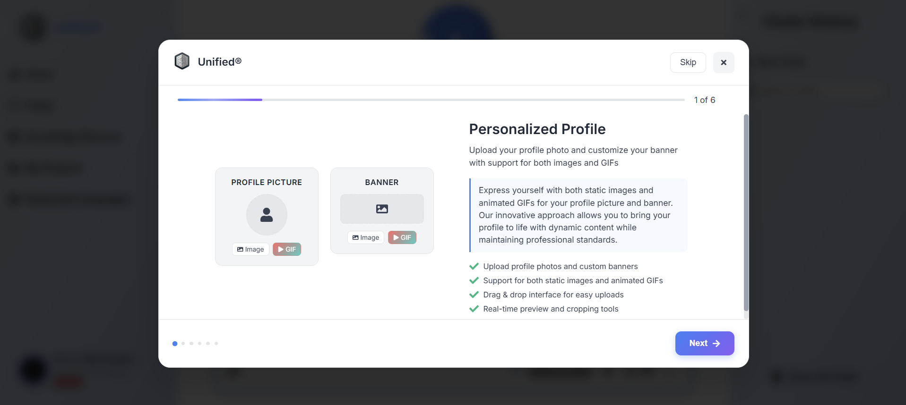
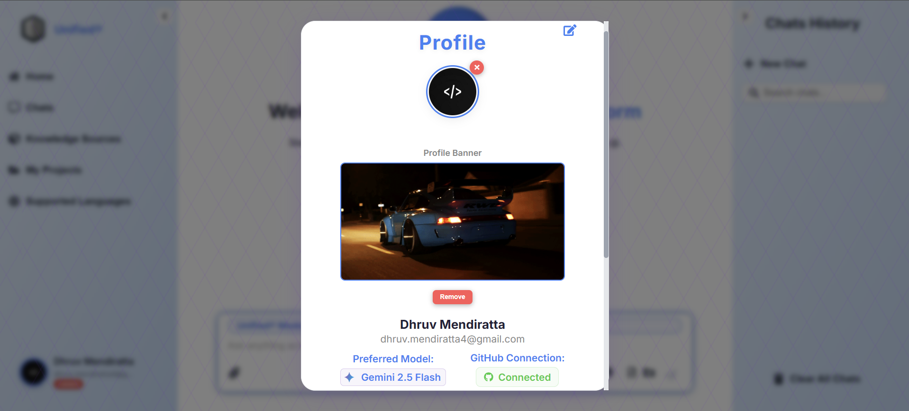
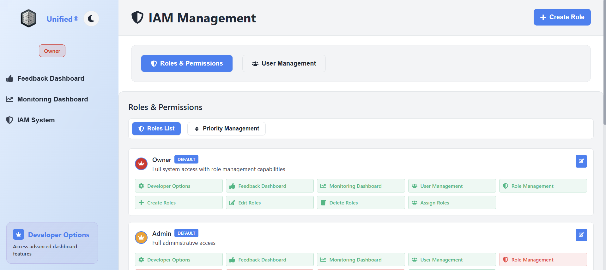
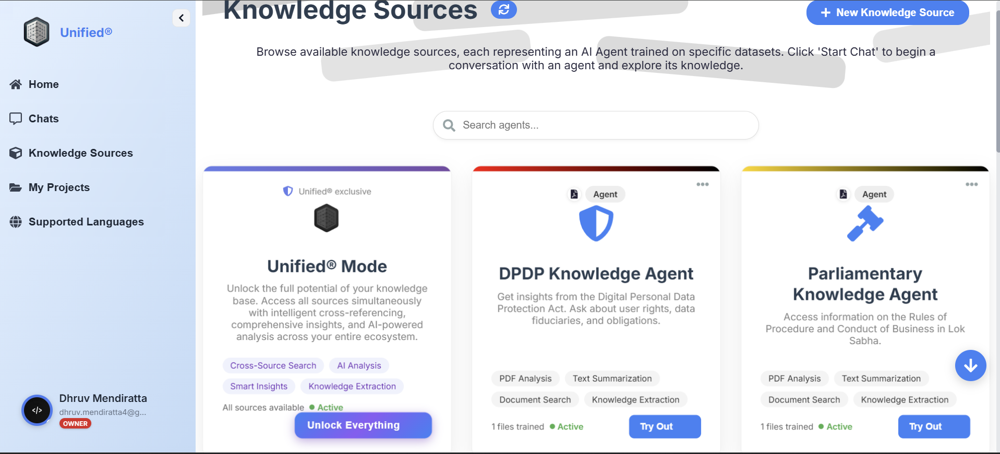
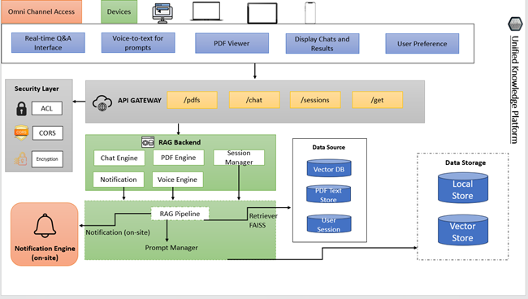

# 🚀 Unified Knowledge Platform (Unified®) 🚀

<div align="center">
  
  
  <h1>Unified® Knowledge Platform</h1>
  <p><strong>AI-Powered Knowledge Management & Retrieval System</strong></p>
  
  <!-- Technology Badges -->
  <div>
    
    
    
    
  </div>

  <!-- Quick Stats -->
  <table align="center">
    <tr>
      <td align="center">
        <strong>🤖 Multi-LLM</strong><br>
        <small>Gemini, Llama3, Mistral</small>
      </td>
      <td align="center">
        <strong>🎯 RAG-Powered</strong><br>
        <small>Accurate Responses</small>
      </td>
      <td align="center">
        <strong>🎨 Modern UI/UX</strong><br>
        <small>Beautiful Design</small>
      </td>
      <td align="center">
        <strong>🎤 Voice Integration</strong><br>
        <small>Hands-free Chat</small>
      </td>
    </tr>
  </table>

  <!-- Quick Links -->
  <p>
    <a href="#overview">🚀 Overview</a> •
    <a href="#features">✨ Features</a> •
    <a href="#installation">📦 Installation</a> •
    <a href="#usage">🎮 Usage</a> •
    <a href="#demo">🎬 Demo</a>
  </p>

</div>

---

---

## 🌟 Overview

The **Unified Knowledge Platform (Unified®)** is a revolutionary AI-powered web application that transforms how you interact with knowledge. Built with cutting-edge technologies, it provides seamless access to internal knowledge sources through natural language queries with mind-blowing features!

### ✨ Key Highlights

| Feature | Description |
|---------|-------------|
| 🤖 **Multi-LLM Support** | Gemini, Llama3, Mistral, and more - choose your AI companion! |
| 🎯 **RAG-Powered** | Retrieval-Augmented Generation for pinpoint accurate responses! |
| 🎨 **Modern UI/UX** | Beautiful, responsive design with stunning dark/light themes! |
| 🎤 **Voice Integration** | ElevenLabs TTS/STT for hands-free interaction! |
| 📱 **User Management** | Complete authentication, profiles, and permissions! |
| 🔄 **Real-time Chat** | Multi-session conversations with source citations! |

---

## 🏗️ Architecture

Our revolutionary system architecture combines cutting-edge technologies to deliver an unparalleled knowledge management experience.

```
┌─────────────────┐    ┌──────────────────┐    ┌─────────────────┐
│   React Frontend │◄──►│  Flask Backend   │◄──►│   LLM Services  │
│                 │    │                  │    │                 │
│ • Chat Interface│    │ • RAG Pipeline   │    │ • Gemini API    │
│ • User Auth     │    │ • Session Mgmt   │    │ • Llama3 Local  │
│ • Voice Features│    │ • PDF Processing │    │ • Mistral API   │
│ • Profile Mgmt  │    │ • Agent System   │    │ • Custom Models │
└─────────────────┘    └──────────────────┘    └─────────────────┘
         │                       │                       │
         │                       │                       │
         ▼                       ▼                       ▼
┌─────────────────┐    ┌──────────────────┐    ┌─────────────────┐
│   LocalStorage   │    │   File System    │    │   Vector DB     │
│                 │    │                  │    │                 │
│ • User Data     │    │ • PDF Documents  │    │ • FAISS Index   │
│ • Chat History  │    │ • Profile Images │    │ • Embeddings    │
│ • Settings      │    │ • Banner Files   │    │ • Search Index  │
└─────────────────┘    └──────────────────┘    └─────────────────┘
```

### 🔧 System Components

| Component | Technology | Features |
|-----------|------------|----------|
| **⚛️ React Frontend** | React 18, CSS3 | Chat Interface, User Auth, Voice Features, Profile Management |
| **🐍 Flask Backend** | Python, Flask | RAG Pipeline, Session Management, PDF Processing, Agent System |
| **🧠 LLM Services** | Gemini, Llama3, Mistral | Multi-model support, API integration, Local deployment |
| **💾 Data Layer** | LocalStorage, File System, FAISS | User data, Document storage, Vector search |

---

## 🎯 Core Features

Our platform offers an incredible array of features that will revolutionize how you interact with knowledge!

### 🤖 **AI & Intelligence**
- **🔮 Multi-Model LLM Support**: Seamlessly switch between Gemini, Llama3, Mistral, and custom models
- **🎯 RAG Pipeline**: Retrieval-Augmented Generation for contextually accurate responses
- **📚 Source Citation**: Direct links to source documents with text highlighting
- **🧠 Context Awareness**: Intelligent conversation memory and context management

### 💬 **Advanced Chat System**
- **🔄 Multi-Session Support**: Manage multiple conversation threads simultaneously
- **⚡ Real-time Streaming**: Live response generation with typing indicators
- **📜 Message History**: Persistent chat history with export capabilities
- **🎤 Voice Interaction**: Speak to chat and hear responses with ElevenLabs

### 👤 **User Management**
- **🔐 Secure Authentication**: Email/password and OTP-based account creation
- **🎨 Profile Customization**: Upload profile pictures and banners (supports GIFs!)
- **👑 Role-Based Access**: Admin, Developer, and User permission levels
- **🔒 Session Management**: Secure login/logout with session persistence

### 🎨 **Modern Interface**
- **📱 Responsive Design**: Works perfectly on desktop, tablet, and mobile
- **🌙 Theme Support**: Beautiful light and dark mode themes
- **♿ Accessibility**: Keyboard navigation and screen reader support
- **✨ Animations**: Smooth transitions and micro-interactions

### 📄 **Document Intelligence**
- **🔍 PDF Processing**: Advanced text extraction and vectorization
- **✨ Source Highlighting**: Direct links to relevant document sections
- **📖 Document Viewer**: Built-in PDF viewer with page navigation
- **📁 Multi-Format Support**: PDF, DOCX, CSV, and more formats

### 📊 **Feature Statistics**

| Metric | Value |
|--------|-------|
| 🚀 **Amazing Features** | 20+ |
| 🤖 **AI Models** | 4+ |
| 📄 **File Formats** | 10+ |
| ⚡ **Responsive Design** | 100% |

---

## 📸 **UI Screenshots & Demo**

<div align="center">

### 🏠 **Login & Authentication**

*Secure authentication with email/password and OTP verification*

### 💬 **Chat Interface**

*Modern chat interface with multi-session support and voice features*

### 🎨 **Welcome Overlay**

*Interactive welcome tour for new users with profile setup*

### 👤 **Profile Management**

*Complete profile customization with GIF support*

### 🔧 **Admin Dashboard**

*Comprehensive admin panel with user management*

### 🎯 **Knowledge Sources**

*Browse and interact with different knowledge agents*

### 🏗️ **Application Structure**

<div align="center">
  
</div>

*Complete project structure and organization*

</div>

---

## 🛠️ **Technology Stack**

<div align="center">

### 🎨 **Frontend Technologies**


### 🐍 **Backend Technologies**


### 🤖 **AI & Machine Learning**


### 🎤 **Voice & Audio**


### 📄 **Document Processing**


### 🔧 **Development Tools**


</div>

### 📋 **Technology Overview**

| Category | Technologies | Purpose |
|----------|--------------|---------|
| **🎨 Frontend** | React 18, CSS3, JavaScript, HTML5 | Modern UI framework with responsive design |
| **🐍 Backend** | Python, Flask, FAISS, LangChain | API development and AI orchestration |
| **🤖 AI/ML** | Gemini, Llama3, Mistral, Transformers | Multi-model LLM support and embeddings |
| **🎤 Voice** | ElevenLabs, Web Speech API | Voice interaction and synthesis |
| **📄 Documents** | PyPDF2, PDF.js, OCR | Document processing and viewing |
| **🔧 Tools** | Node.js, Git, VS Code | Development and version control |

---

## 📦 Installation & Setup

### Prerequisites
- **Python 3.9+** with pip
- **Node.js 16+** with npm
- **Git** for version control
- **API Keys** for external services

### 1. Clone Repository
```bash
git clone <your-repo-url>
cd EY_RAG_Project
```

### 2. Backend Setup
```bash
# Create virtual environment
python -m venv venv
source venv/bin/activate  # Windows: venv\Scripts\activate

# Install dependencies
pip install -r requirements.txt
cd backend
pip install -r requirements.txt
cd ..
```

### 3. Frontend Setup
```bash
cd react-frontend
npm install
```

### 4. Environment Configuration
Create a `.env` file in the project root:
```env
# API Keys
GOOGLE_API_KEY=your_gemini_api_key_here
ELEVENLABS_API_KEY=your_elevenlabs_api_key_here
SARVAM_API_KEY=your_sarvam_api_key_here
FLASK_SECRET_KEY=your_flask_secret_key_here

# Application Settings
MAX_CONVERSATION_HISTORY=10
DEBUG_MODE=true
```

### 5. Document Setup
```bash
# Place your PDF documents in the backend/pdfs/ directory
mkdir -p backend/pdfs
# Copy your documents: DPDP_act.pdf, Rules_of_Procedures_Lok_Sabha.pdf, etc.
```

---

## 🚀 Running the Application

### Start Backend Server
```bash
python backend.py
```
Backend will be available at `http://localhost:5000`

### Start Frontend Development Server
```bash
cd react-frontend
npm start
```
Frontend will be available at `http://localhost:3000`

### Production Build
```bash
cd react-frontend
npm run build
```

---

## 🎮 Usage Guide

### 🔐 **Getting Started**
1. **Create Account**: Use the registration form with email verification
2. **Welcome Tour**: New users get an interactive welcome overlay
3. **Profile Setup**: Upload your profile picture and banner
4. **Start Chatting**: Begin asking questions about your documents

### 💬 **Chat Interface**
- **Ask Questions**: Type natural language queries
- **Mention Agents**: Use `@AgentName` to specify knowledge sources
- **Voice Input**: Click the microphone for voice queries
- **Quick Actions**: Use predefined templates for common tasks

### 👤 **User Features**
- **Profile Management**: Update your profile picture and banner
- **Theme Switching**: Toggle between light and dark modes
- **Session Management**: View and manage your chat sessions
- **Export Data**: Download chat history and responses

### 🔧 **Admin Features**
- **User Management**: View and manage user accounts
- **Developer Options**: Access advanced features and debugging
- **System Monitoring**: View usage analytics and performance

---

## 📁 Project Structure

```
EY_RAG_Project/
├── 📁 backend/                    # Backend Python application
│   ├── 📁 pdfs/                   # Source PDF documents
│   ├── 📁 faiss_index/            # FAISS vector index files
│   ├── 📁 utils/                  # Utility modules
│   ├── 📄 pdf_utils.py            # PDF processing utilities
│   ├── 📄 RAGPipeline.py          # RAG pipeline implementation
│   ├── 📄 banner_utils.py         # Banner file management
│   ├── 📄 requirements.txt        # Backend dependencies
│   └── 📄 ...
├── 📁 react-frontend/             # React frontend application
│   ├── 📁 src/
│   │   ├── 📁 components/         # React components
│   │   │   ├── 📄 WelcomeOverlay.js    # Welcome tour component
│   │   │   ├── 📄 ProfileModal.js      # Profile management
│   │   │   ├── 📄 OTPVerification.js   # OTP verification
│   │   │   └── 📄 ...
│   │   ├── 📁 views/              # Page components
│   │   ├── 📁 styles/             # CSS stylesheets
│   │   ├── 📁 utils/              # Frontend utilities
│   │   └── 📄 App.js              # Main application component
│   ├── 📁 public/                 # Static assets
│   └── 📄 package.json            # Frontend dependencies
├── 📄 backend.py                  # Main Flask server
├── 📄 prompts.py                  # LLM prompt templates
├── 📄 requirements.txt            # Top-level dependencies
├── 📄 README.md                   # Project documentation
└── 📄 .env                        # Environment configuration
```

---

## 🆕 Recent Features & Updates

### 🎉 **Welcome Overlay System**
- **Interactive Tour**: New users get a beautiful 6-step welcome tour
- **Profile Setup**: Integrated profile picture and banner upload
- **GIF Support**: First platform to support animated GIFs for profiles
- **Auto-Save**: Images automatically save when proceeding through tour

### 🔐 **Enhanced Authentication**
- **OTP Verification**: Secure 6-digit OTP for account creation and deletion
- **Auto-Verification**: OTP automatically verifies when all digits are entered
- **Account Management**: Complete user lifecycle management
- **Security**: Proper session handling and data cleanup

### 🎨 **Profile Management**
- **Profile Pictures**: Upload and manage profile photos with compression
- **Banner Images**: Custom banner uploads with file system storage
- **GIF Support**: Animated GIFs for both profile and banner images
- **Theme Integration**: Seamless integration with light/dark themes

### 💬 **Advanced Chat Features**
- **Multi-Session**: Manage multiple conversation threads
- **Voice Integration**: ElevenLabs TTS/STT for voice interaction
- **Source Linking**: Direct links to source documents
- **Export Capabilities**: Download chat history and responses

### 🔧 **Developer Features**
- **Admin Panel**: Comprehensive user and system management
- **Debug Tools**: Testing utilities for welcome overlay and OTP
- **Monitoring**: Usage analytics and performance tracking
- **Role-Based Access**: Granular permission system

---


---

## 🛠️ Development

### Adding New Features
1. **Frontend Components**: Add React components in `react-frontend/src/components/`
2. **Backend APIs**: Extend Flask routes in `backend.py`
3. **Styling**: Add CSS in `react-frontend/src/styles/`
4. **Testing**: Use admin tools for feature testing

### Code Style
- **Frontend**: React functional components with hooks
- **Backend**: Flask with proper error handling
- **Styling**: CSS variables for theme consistency
- **Documentation**: Comprehensive comments and README

### Debugging
- **Browser Console**: Frontend debugging
- **Flask Logs**: Backend debugging
- **Admin Tools**: Built-in testing utilities
- **Environment Variables**: Secure configuration management

---

## 🤝 Contributing

1. **Fork** the repository
2. **Create** a feature branch
3. **Make** your changes
4. **Test** thoroughly
5. **Submit** a pull request

### Development Guidelines
- Follow existing code style
- Add comprehensive documentation
- Test all features thoroughly
- Update README for new features

---

## 📄 License

This project uses a **Non-Commercial Software License** that protects the creator's rights while encouraging open collaboration.

### ✅ **What's Allowed:**
- Personal, educational, and non-commercial use
- Forking and modifying for personal/educational purposes  
- Contributing improvements and suggestions via pull requests
- Academic research and learning
- Open source collaboration and development
- Sharing and redistributing for non-commercial purposes
- Building upon the material for personal projects

### ❌ **What Requires Permission:**
- Commercial use of any kind
- Selling the software or derivative works
- Using in commercial products or services
- Generating revenue from the software
- Using in a business context
- Licensing to others for commercial purposes
- Integration into commercial applications

### 📧 **Requesting Commercial Permission:**
For commercial use, please contact:
- **Email**: dhruv.mendiratta4@gmail.com
- **GitHub**: [@dhruvm-18](https://github.com/dhruvm-18)
- **LinkedIn**: [Dhruv Mendiratta](www.linkedin.com/in/dhruvmendiratta18)

Include in your request:
- Intended use case and business model
- Company/organization details
- Expected user base and scale
- Revenue model and pricing (if applicable)
- Timeline for implementation
- Specific features you plan to use

**Full License**: See [LICENSE](LICENSE) file for complete details.

---

## 👨‍💻 Credits

**Developed by:** Dhruv Mendiratta

**Technologies Used:**
- Flask, React, LangChain, Gemini, FAISS, ElevenLabs
- Modern web technologies and AI/ML frameworks

**Special Thanks:**
- Google Gemini API for LLM capabilities
- ElevenLabs for voice synthesis
- Open source community for amazing tools

---

## 📞 Support

For support, questions, or feature requests:
- **Issues**: Create an issue on GitHub
- **Documentation**: Check this README and inline code comments
- **Development**: Use admin tools for testing and debugging

---

<div align="center">
  <p><strong>Unified® Knowledge Platform</strong></p>
  <p>Empowering knowledge discovery through AI</p>
</div>
